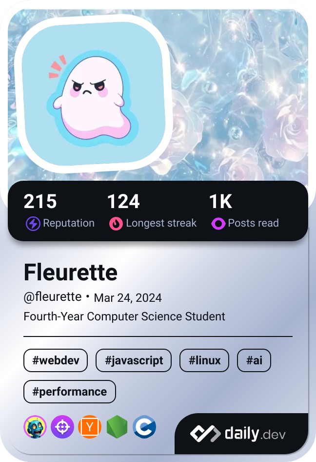

# 💫 About Me:

<h5>🔭 I’m currently tinkering away on my super-secret repositories like a little code gremlin!</h5>
<h5>🌱 I'm currently learning the things whatever my heart wants. </h5>
<h5>💬 Ask me anything, and I’ll sprinkle you with delightfully wrong answers </h5>
<h5>🍰 I’m powered by sweets, chaos, and an unhealthy obsession with programming</h5>
<h5>💖 Random love: Late-night vibes, cozy blankets, and the sound of rain tapping on my window</h5>
<h5>⚡ Fun fact: I use Arch because I'm a fancy tech person who loves a challenge </h5>

### 🪪 DevCard

### 🎧 Spotify

<table>
  <tr>
    <td>
      
    </td>
    <td>
      <a href="https://spotify-github-profile.kittinanx.com/api/view?uid=31yh4jb2u4dxeck264lb3iutlcbe&redirect=true">
      
    </td>
  </tr>
</table>

# 🌐 Socials:

# 💻 Tech Stack:

### 🌐 Languages

### ☁️ Hosting/SaaS

### 🛠️ Frameworks, Platforms & Libraries

### 🗄️ Databases/ORM

### 🤖 ML/DL

### 🚀 CI/CD VCS
 
 
 

### Other

 
 
 
 
 
 
 
 
 
 
 
 

##  

# 🛡️ Badges:

# GitHub Stats:

  

## 🏆 GitHub Trophies

## 🌟 Contributions

<picture>
    <source media="(prefers-color-scheme: dark)" srcset="https://raw.githubusercontent.com/Xylphy/Xylphy/output/pacman-contribution-graph-dark.svg">
    <source media="(prefers-color-scheme: light)" srcset="https://raw.githubusercontent.com/Xylphy/Xylphy/output/pacman-contribution-graph.svg"> 
    
</picture>

<picture>
  <source
    media="(prefers-color-scheme: dark)"
    srcset="https://raw.githubusercontent.com/Xylphy/Xylphy/github-breakout/images/breakout-dark.svg"
  />
  <source
    media="(prefers-color-scheme: light)"
    srcset="https://raw.githubusercontent.com/Xylphy/Xylphy/github-breakout/images/breakout-light.svg"
  />
  
</picture>

---

| ✍️ Random Dev Quote                                                               | 🔝 Top Contributed Repo                                                                                                                      |
| --------------------------------------------------------------------------------- | -------------------------------------------------------------------------------------------------------------------------------------------- |
|  |  |

# 🐥 Pets

|                                                                            |                                                                            |
| -------------------------------------------------------------------------- | -------------------------------------------------------------------------- |
|                     |  |
|  |  |

---

